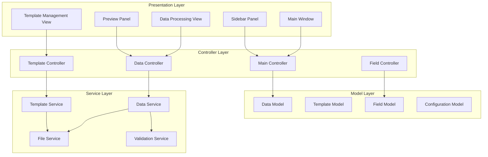
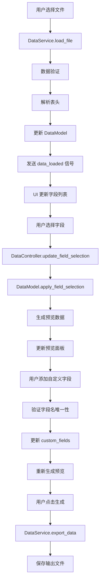

# Design Document

## Overview

Excel Data Processor 是一个基于 PySide6 的现代桌面应用程序，采用 Model-View-Controller (MVC) 架构模式。应用程序使用 pandas 进行高效的数据处理，通过 JSON 格式管理模板配置，并提供直观的现代化用户界面。

核心设计理念：
- **分离关注点**: 数据处理、UI 展示和业务逻辑完全分离
- **事件驱动**: 利用 Qt 的信号槽机制实现组件间通信
- **响应式设计**: 实时预览和状态反馈
- **可扩展性**: 模块化设计支持功能扩展

## Architecture

### 整体架构



### 核心组件关系

- **Main Controller**: 协调各个子控制器，管理应用程序状态
- **Data Controller**: 处理数据导入、字段选择和预览逻辑
- **Template Controller**: 管理模板的保存、加载和验证
- **Field Controller**: 处理字段选择和自定义字段管理

## Components and Interfaces

### 1. 用户界面组件

#### MainWindow
```python
class MainWindow(QMainWindow):
    """主窗口类，管理整体布局和导航"""
    
    # 信号定义
    view_changed = Signal(str)  # 视图切换信号
    
    def __init__(self):
        # 初始化侧边栏和主内容区域
        # 设置现代化样式表
        pass
    
    def setup_ui(self) -> None:
        # 创建侧边栏和内容区域
        # 应用样式表和布局
        pass
    
    def switch_view(self, view_name: str) -> None:
        # 切换到指定视图
        pass
```

#### SidebarPanel
```python
class SidebarPanel(QWidget):
    """侧边栏导航组件"""
    
    # 信号定义
    navigation_requested = Signal(str)
    
    def __init__(self):
        # 创建导航按钮
        # 设置样式和布局
        pass
```

#### DataProcessingView
```python
class DataProcessingView(QWidget):
    """数据处理主视图"""
    
    # 信号定义
    file_import_requested = Signal()
    field_selection_changed = Signal(list)
    custom_field_added = Signal(str, str)
    generate_requested = Signal()
    
    def __init__(self):
        # 创建文件导入区域
        # 创建字段选择区域
        # 创建自定义字段区域
        # 创建预览区域
        pass
```

#### TemplateManagementView
```python
class TemplateManagementView(QWidget):
    """模板管理视图"""
    
    # 信号定义
    template_save_requested = Signal(str)
    template_load_requested = Signal(str)
    template_delete_requested = Signal(str)
    
    def __init__(self):
        # 创建模板列表
        # 创建操作按钮
        pass
```

### 2. 控制器组件

#### MainController
```python
class MainController(QObject):
    """主控制器，协调各个子系统"""
    
    def __init__(self, main_window: MainWindow):
        self.main_window = main_window
        self.data_controller = DataController()
        self.template_controller = TemplateController()
        self.field_controller = FieldController()
        
        # 连接信号槽
        self._connect_signals()
    
    def _connect_signals(self) -> None:
        # 连接各组件的信号槽
        pass
```

#### DataController
```python
class DataController(QObject):
    """数据处理控制器"""
    
    # 信号定义
    data_loaded = Signal(object)  # pandas DataFrame
    preview_updated = Signal(object)
    processing_completed = Signal(str)
    error_occurred = Signal(str)
    
    def __init__(self):
        self.data_service = DataService()
        self.current_data = None
        self.selected_fields = []
        self.custom_fields = {}
    
    def import_file(self, file_path: str) -> None:
        # 导入文件并发出信号
        pass
    
    def update_field_selection(self, selected_fields: list) -> None:
        # 更新字段选择并刷新预览
        pass
    
    def add_custom_field(self, name: str, default_value: str) -> None:
        # 添加自定义字段
        pass
    
    def generate_output(self, output_path: str) -> None:
        # 生成输出文件
        pass
```

### 3. 数据模型

#### DataModel
```python
@dataclass
class DataModel:
    """数据模型，封装 pandas DataFrame"""
    
    raw_data: pd.DataFrame = None
    processed_data: pd.DataFrame = None
    columns: List[str] = field(default_factory=list)
    selected_columns: List[str] = field(default_factory=list)
    custom_fields: Dict[str, str] = field(default_factory=dict)
    
    def get_preview_data(self, rows: int = 5) -> pd.DataFrame:
        # 返回预览数据
        pass
    
    def apply_field_selection(self) -> None:
        # 应用字段选择生成处理后的数据
        pass
```

#### TemplateModel
```python
@dataclass
class TemplateModel:
    """模板配置模型"""
    
    name: str
    selected_fields: List[str]
    custom_fields: Dict[str, str]
    created_at: datetime
    description: str = ""
    
    def to_dict(self) -> Dict:
        # 转换为字典格式用于 JSON 序列化
        pass
    
    @classmethod
    def from_dict(cls, data: Dict) -> 'TemplateModel':
        # 从字典创建模板对象
        pass
```

### 4. 服务层组件

#### DataService
```python
class DataService:
    """数据处理服务"""
    
    def __init__(self):
        self.validation_service = ValidationService()
    
    def load_file(self, file_path: str) -> pd.DataFrame:
        # 根据文件扩展名选择合适的读取方法
        # 支持 .xlsx, .csv 格式
        # 进行数据验证
        pass
    
    def process_data(self, 
                    data: pd.DataFrame, 
                    selected_fields: List[str],
                    custom_fields: Dict[str, str]) -> pd.DataFrame:
        # 应用字段选择和自定义字段
        pass
    
    def export_data(self, data: pd.DataFrame, output_path: str) -> None:
        # 导出处理后的数据
        pass
```

#### TemplateService
```python
class TemplateService:
    """模板管理服务"""
    
    def __init__(self, templates_dir: str = "templates"):
        self.templates_dir = Path(templates_dir)
        self.templates_dir.mkdir(exist_ok=True)
    
    def save_template(self, template: TemplateModel) -> None:
        # 保存模板到 JSON 文件
        pass
    
    def load_template(self, template_name: str) -> TemplateModel:
        # 从 JSON 文件加载模板
        pass
    
    def list_templates(self) -> List[str]:
        # 列出所有可用模板
        pass
    
    def delete_template(self, template_name: str) -> None:
        # 删除指定模板
        pass
```

## Data Models

### 数据流设计



### 配置数据结构

```json
{
  "template_name": "销售数据处理模板",
  "version": "1.0",
  "created_at": "2024-01-07T10:30:00Z",
  "description": "用于处理月度销售数据的标准模板",
  "selected_fields": [
    "产品名称",
    "销售数量",
    "单价",
    "销售日期"
  ],
  "custom_fields": {
    "总金额": "销售数量 * 单价",
    "处理日期": "2024-01-07",
    "状态": "已处理"
  },
  "field_mappings": {
    "产品名称": "product_name",
    "销售数量": "quantity",
    "单价": "unit_price"
  }
}
```

## Correctness Properties

*A property is a characteristic or behavior that should hold true across all valid executions of a system-essentially, a formal statement about what the system should do. Properties serve as the bridge between human-readable specifications and machine-verifiable correctness guarantees.*

基于需求分析，以下是系统必须满足的核心正确性属性：

### Property 1: 文件读取一致性
*For any* 有效的 .xlsx 或 .csv 文件，系统应该能够成功读取并正确解析表头字段，解析出的字段数量应该等于文件中实际的列数
**Validates: Requirements 1.2, 1.4, 2.1**

### Property 2: 字段选择状态管理
*For any* 字段选择操作（勾选或取消勾选），系统的字段选择状态应该准确反映用户的操作，且预览面板应该实时更新以反映当前选择
**Validates: Requirements 2.2, 2.3, 2.4**

### Property 3: 自定义字段管理完整性
*For any* 自定义字段操作（添加或删除），系统应该正确验证字段名唯一性，成功的操作应该正确更新字段列表，且字段配置应该在预览中正确显示
**Validates: Requirements 3.2, 3.3, 3.4, 3.5**

### Property 4: 模板配置往返一致性
*For any* 有效的模板配置，保存然后加载该模板应该完全恢复原始的字段选择和自定义字段配置状态
**Validates: Requirements 4.1, 4.4**

### Property 5: 模板名称唯一性验证
*For any* 模板名称，系统应该正确验证其唯一性，重复的名称应该被拒绝并显示错误提示
**Validates: Requirements 4.2**

### Property 6: 数据处理输出一致性
*For any* 有效的字段配置（包括选择的原始字段和自定义字段），数据处理应该生成包含所有指定字段的输出，且自定义字段应该包含正确的默认值
**Validates: Requirements 5.1, 5.3**

### Property 7: 预览数据准确性
*For any* 字段配置变化，预览面板显示的数据应该准确反映最终输出的前5行，包括列标题和数据内容
**Validates: Requirements 6.1, 6.5**

### Property 8: 错误处理一致性
*For any* 无效输入或操作失败情况（无效文件格式、损坏的模板、处理错误等），系统应该显示具体的错误信息并保持当前状态不变
**Validates: Requirements 1.3, 1.5, 4.5, 5.5, 8.1, 8.2**

### Property 9: 界面导航状态管理
*For any* 功能模块切换操作，系统应该正确切换到对应的界面，且当前的数据和配置状态应该得到保持
**Validates: Requirements 7.3**

### Property 10: 操作反馈完整性
*For any* 成功完成的操作，系统应该提供明确的成功反馈，且用户应该能够撤销可撤销的操作
**Validates: Requirements 8.3, 8.5**

## Error Handling

### 错误分类和处理策略

#### 1. 文件操作错误
- **文件不存在或无法访问**: 显示文件路径和权限相关的错误信息
- **文件格式不支持**: 列出支持的格式并提供格式转换建议
- **文件内容损坏**: 提供具体的损坏位置和可能的修复建议
- **文件过大**: 显示文件大小限制和处理建议

#### 2. 数据处理错误
- **空数据文件**: 提示用户检查文件内容
- **数据类型不兼容**: 显示具体的类型冲突和转换选项
- **内存不足**: 提供数据分块处理的建议
- **编码问题**: 自动检测编码并提供手动选择选项

#### 3. 配置验证错误
- **字段名冲突**: 高亮显示冲突的字段名并提供重命名建议
- **无效的默认值**: 显示数据类型要求和格式示例
- **模板格式错误**: 提供模板修复工具或重新创建选项

#### 4. 系统资源错误
- **磁盘空间不足**: 显示所需空间和清理建议
- **网络连接问题**: 提供离线模式选项
- **权限不足**: 显示具体的权限要求

### 错误恢复机制

```python
class ErrorHandler:
    """统一错误处理器"""
    
    def handle_file_error(self, error: Exception, file_path: str) -> ErrorResponse:
        # 根据错误类型提供具体的处理建议
        pass
    
    def handle_data_error(self, error: Exception, context: Dict) -> ErrorResponse:
        # 提供数据相关的错误处理和恢复选项
        pass
    
    def handle_validation_error(self, error: ValidationError) -> ErrorResponse:
        # 提供配置验证错误的详细信息和修复建议
        pass
```

## Testing Strategy

### 双重测试方法

本项目采用单元测试和基于属性的测试相结合的策略：

#### 单元测试
- **具体示例验证**: 测试特定的输入输出场景
- **边缘情况处理**: 验证空文件、单列数据、特殊字符等边缘情况
- **集成点测试**: 验证组件间的接口和数据传递
- **UI 交互测试**: 验证按钮点击、对话框显示等用户交互

#### 基于属性的测试 (Property-Based Testing)
- **使用 Hypothesis 库**: 为 Python 生态系统中成熟的属性测试框架
- **最小100次迭代**: 每个属性测试运行至少100次以确保充分覆盖
- **智能数据生成**: 生成符合实际使用场景的测试数据

#### 测试配置要求
- **属性测试标记格式**: `# Feature: excel-data-processor, Property {number}: {property_text}`
- **测试数据生成策略**:
  - Excel 文件: 生成包含不同数据类型的有效 .xlsx 文件
  - CSV 文件: 生成各种编码和分隔符的 .csv 文件
  - 字段名: 生成包含中文、英文、数字和特殊字符的字段名
  - 配置数据: 生成各种字段选择和自定义字段组合

#### 测试框架选择
- **单元测试**: pytest + pytest-qt (用于 Qt 应用测试)
- **属性测试**: Hypothesis
- **模拟和存根**: unittest.mock
- **测试数据**: pandas.testing 用于 DataFrame 比较

### 测试覆盖目标
- **代码覆盖率**: 目标 90% 以上
- **功能覆盖率**: 所有用户可见功能 100% 覆盖
- **错误路径覆盖**: 所有错误处理分支 100% 覆盖
- **性能测试**: 大文件处理和内存使用监控
